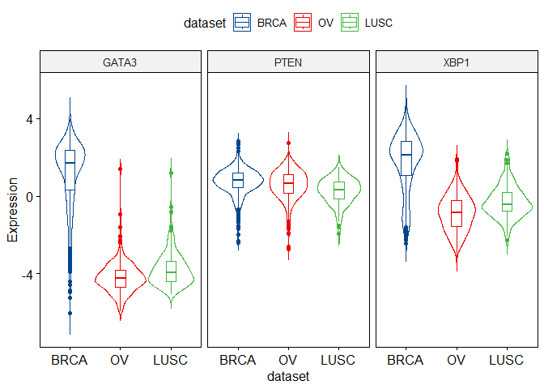

viz\_02
================
Faith Igomodu
June 10, 2024

# Exploratory Data Analysis of Gene Expression Dataset

Exploratory data analysis dives deep into gene expression data to
uncover the inherent patterns and make sense of it. To accomplish this,
several plots are used:

-   Box plot
-   Violin plot
-   Stripchart
-   Dot plot
-   Histogram and density plots
-   ECDF plot
-   Q-Q plot
-   Volcano plot
-   Heatmaps
-   Dendograms

For this practice set, will generate violin plot using gene expressioni
data from the Cancer Genome Atlas Dataset.

## Load Libraries

``` r
#Data Visualization 
library(ggplot2)
library(ggpubr)

#Datasets 
library(RTCGA)
```

    ## Welcome to the RTCGA (version: 1.34.0). Read more about the project under https://rtcga.github.io/RTCGA/

``` r
library(RTCGA.clinical)
library(RTCGA.mRNA)
```

## Data Processing & Cleaning

Extracted mRNA data from TCGA dataset.

``` r
#Extract data from TCGA dataset 
expr_data <- expressionsTCGA(BRCA.mRNA, OV.mRNA, LUSC.mRNA,
                        extract.cols = c("GATA3", "PTEN", "XBP1","ESR1", "MUC1"))
expr_data
```

    ## # A tibble: 1,305 × 7
    ##    bcr_patient_barcode          dataset    GATA3   PTEN   XBP1   ESR1    MUC1
    ##    <chr>                        <chr>      <dbl>  <dbl>  <dbl>  <dbl>   <dbl>
    ##  1 TCGA-A1-A0SD-01A-11R-A115-07 BRCA.mRNA  2.87   1.36   2.98   3.08   1.65  
    ##  2 TCGA-A1-A0SE-01A-11R-A084-07 BRCA.mRNA  2.17   0.428  2.55   2.39   3.08  
    ##  3 TCGA-A1-A0SH-01A-11R-A084-07 BRCA.mRNA  1.32   1.31   3.02   0.791  2.99  
    ##  4 TCGA-A1-A0SJ-01A-11R-A084-07 BRCA.mRNA  1.84   0.810  3.13   2.50  -1.92  
    ##  5 TCGA-A1-A0SK-01A-12R-A084-07 BRCA.mRNA -6.03   0.251 -1.45  -4.86  -1.17  
    ##  6 TCGA-A1-A0SM-01A-11R-A084-07 BRCA.mRNA  1.80   1.31   4.04   2.80   3.53  
    ##  7 TCGA-A1-A0SO-01A-22R-A084-07 BRCA.mRNA -4.88  -0.237 -0.725 -4.49  -1.46  
    ##  8 TCGA-A1-A0SP-01A-11R-A084-07 BRCA.mRNA -3.14  -1.24  -1.19  -1.63  -0.987 
    ##  9 TCGA-A2-A04N-01A-11R-A115-07 BRCA.mRNA  2.03   1.21   2.28   4.12   0.668 
    ## 10 TCGA-A2-A04P-01A-31R-A034-07 BRCA.mRNA -0.293  0.288 -1.61   0.473  0.0115
    ## # ℹ 1,295 more rows

``` r
#Determine number of samples in each dataset 

samples_num <- table(expr_data$dataset)
samples_num
```

    ## 
    ## BRCA.mRNA LUSC.mRNA   OV.mRNA 
    ##       590       154       561

``` r
#Simplify name of dataset by removing mRNA 
expr_data$dataset <- gsub(pattern = ".mRNA", replacement = "",  expr_data$dataset)
```

``` r
#Simplify patient barcode column 
expr_data$bcr_patient_barcode <- paste0(expr_data$dataset, c(1:590, 1:561, 1:154))
expr_data
```

    ## # A tibble: 1,305 × 7
    ##    bcr_patient_barcode dataset  GATA3   PTEN   XBP1   ESR1    MUC1
    ##    <chr>               <chr>    <dbl>  <dbl>  <dbl>  <dbl>   <dbl>
    ##  1 BRCA1               BRCA     2.87   1.36   2.98   3.08   1.65  
    ##  2 BRCA2               BRCA     2.17   0.428  2.55   2.39   3.08  
    ##  3 BRCA3               BRCA     1.32   1.31   3.02   0.791  2.99  
    ##  4 BRCA4               BRCA     1.84   0.810  3.13   2.50  -1.92  
    ##  5 BRCA5               BRCA    -6.03   0.251 -1.45  -4.86  -1.17  
    ##  6 BRCA6               BRCA     1.80   1.31   4.04   2.80   3.53  
    ##  7 BRCA7               BRCA    -4.88  -0.237 -0.725 -4.49  -1.46  
    ##  8 BRCA8               BRCA    -3.14  -1.24  -1.19  -1.63  -0.987 
    ##  9 BRCA9               BRCA     2.03   1.21   2.28   4.12   0.668 
    ## 10 BRCA10              BRCA    -0.293  0.288 -1.61   0.473  0.0115
    ## # ℹ 1,295 more rows

## Basics of Violin Plot

``` r
ggviolin(expr_data, x = "dataset",
          y = c("GATA3", "PTEN", "XBP1"),
          combine = TRUE, 
          color = "dataset", palette = "lancet",
          ylab = "Expression", 
          add = "boxplot")
```

<!-- -->
